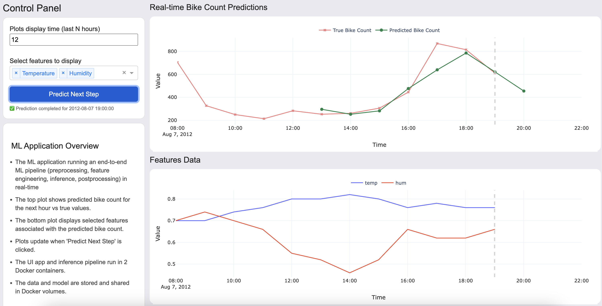
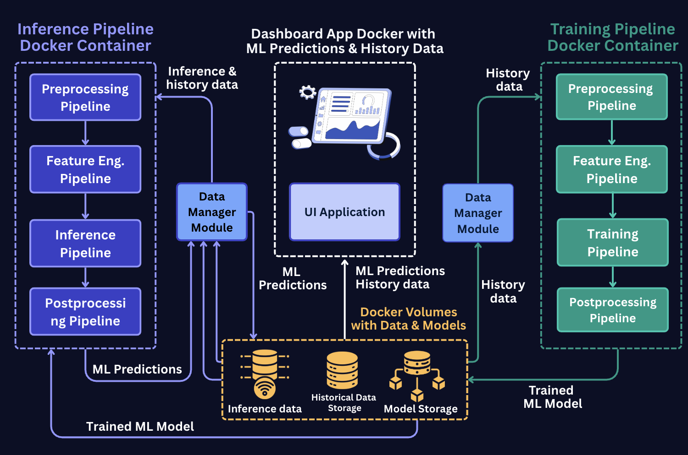

# 🚲 Bike Rental Demand Forecasting System

## A Machine Learning Application that forecasts hour-ahead bike rental demand across an entire city, enabling dynamic pricing optimization and revenue maximization.



## 🎯 Executive Summary

This **Real-Time Bike Rental Demand Forecasting System** solves a critical business problem for bike-sharing platforms operating across entire cities. The system provides hour-ahead demand predictions that drive dynamic pricing strategies, enabling revenue optimization and improved fleet utilization.


## Business Problem Solved

**Challenge**: Bike-sharing platforms need to optimize dynamic pricing based on predicted demand to:
- **Maximize Revenue**: Increase prices during high-demand surges
- **Stimulate Demand**: Lower prices during slow periods to attract riders
- **Optimize Fleet**: Better plan supply-demand balance and bike distribution

**Solution**: A real-time ML system that forecasts city-wide bike rental demand for the next hour, enabling:
- **Dynamic Pricing Optimization**: Real-time price adjustments based on demand forecasts
- **Incentive Campaigns**: Targeted promotions during predicted low-demand periods
- **Operational Planning**: Improved fleet utilization and supply-demand balance

<!-- ## Application architecture
The architecture of the system is shown below:

 -->

### End-to-End ML Pipeline Architecture

The system implements a comprehensive machine learning pipeline with five distinct stages:

#### 1. **Preprocessing Pipeline**
- **Column Renaming**: Configurable column mapping for data standardization
- **Column Dropping**: Removal of unnecessary columns based on configuration
- **Data Reset**: Index reset for clean data structure
- **Configuration-Driven**: All preprocessing steps controlled via config parameters

#### 2. **Feature Engineering Pipeline**
- **Lag Features**: Creation of time-lagged features for time series forecasting
- **Configurable Lags**: Multiple lag periods (e.g., 1, 2, 3, 5, 10 periods) for different features
- **Backward Fill**: Handling of missing values in lag features using bfill method
- **Feature Naming**: Automatic naming convention: `{feature}_lag_{period}`

#### 3. **Training Pipeline**
- **Target Creation**: Shifted target variable for forecasting (configurable shift period)
- **Time-Series Split**: Train-test split without shuffling to preserve temporal order
- **CatBoost Model**: Gradient boosting regressor with configurable parameters
- **Optuna Hyperparameter Tuning**: Automated optimization of learning_rate, depth, and l2_leaf_reg
- **Early Stopping**: Prevents overfitting with configurable early stopping rounds
- **Time-Based Validation**: Manual validation split within training data

#### 4. **Inference Pipeline**
- **Model Loading**: Dynamic model loading from specified path
- **Single Prediction**: Returns only the last prediction value for real-time forecasting
- **Feature Preparation**: Input DataFrame processing for model inference
- **Timestamp Integration**: Current timestamp handling for prediction tracking

#### 5. **Postprocessing Pipeline**
- **Model Persistence**: Automated model saving after training
- **Prediction Formatting**: Single-row DataFrame with timestamp and prediction columns
- **Time Increment**: Configurable time increment for prediction timestamps
- **Data Structure**: Standardized output format for downstream processing

### 🐳 Entrypoints
- **`app-ml/train.py`**: Model training entrypoint boith locally and in production
- **`app-ml/inference.py`** Entrypoint to run inference pipeline locally
- **`app-ml/inference-api.py`**: API for inference in production / on web-app
- **`app-ui/app.py`**: Interactive dashboard for demand reocasting monitoring

---

<!-- ## 🚀 Quick Start

### Option 1: Running Application in Docker (Recommended)

```bash
# Clone the repository
git clone <your-repo-url>
cd ml-project-blueprint

# Deploy all services with production configuration
docker-compose up --build

# Verify service health
docker-compose ps
docker-compose logs -f

# Access the application
# 🌐 UI Dashboard: http://localhost:8050
# 🔌 Inference API: http://localhost:5001/health
```

**Expected Output:**
```
✅ app-ml-train         Up
✅ app-ml-inference-api Up  
✅ app-ui              Up
```

### Option 2: Running Application Locally

```bash
# Clone the repository
git clone <your-repo-url>
cd ml-project-blueprint

# Create and activate conda environment
conda env create -f environment.yml
conda activate ml-blueprint

# Train the model first (if not already trained)
python app-ml/entrypoint/rain.py

# Run inference in a loop 
python app-ml/entrypoint/inference.py

# Start the inference API tomlink to the application UI
python app-ml/entrypoint/inference_api.py

# Start the UI dashboard in another terminal
cd app-ui
python app.py
```

**Access the application:**
- 🌐 **UI Dashboard**: http://localhost:8050
- 🔌 **Inference API**: http://localhost:5001


## 📁 Project Architecture & Data Flow

```
ml-project-blueprint/
├── 📁 app-ml/                           # Demand Forecasting Engine
│   ├── 📁 entrypoint/                  # Production ML Services
│   │   ├── prod_train.py               # Demand model training pipeline
│   │   ├── prod_inference.py           # Batch demand prediction service
│   │   └── inference_api.py            # Real-time demand prediction API
│   ├── 📁 notebooks/                   # Data Science & Analysis
│   │   ├── EDA.ipynb                   # Demand pattern analysis
│   │   └── Modeling.ipynb              # Demand forecasting model development
│   ├── 📁 src/                         # Core Forecasting Pipeline
│   │   ├── 📁 pipelines/               # Modular demand forecasting components
│   │   │   ├── preprocessing.py        # Rental data preprocessing
│   │   │   ├── feature_engineering.py  # Weather & temporal feature creation
│   │   │   ├── training.py             # Demand model training pipeline
│   │   │   ├── inference.py            # Real-time demand prediction
│   │   │   └── postprocessing.py       # Pricing optimization logic
│   │   └── utils.py                    # Forecasting utilities & helpers
│   ├── Dockerfile                      # ML service containerization
│   └── requirements.txt                # ML dependencies
├── 📁 app-ui/                          # Dynamic Pricing Dashboard
│   ├── app.py                          # Main pricing dashboard application
│   ├── assets/                         # Dashboard styling & assets
│   ├── Dockerfile                      # UI service containerization
│   └── requirements.txt                # UI dependencies
├── 📁 common/                          # Shared Business Logic
│   ├── data_manager.py                 # Rental data management & persistence
│   └── utils.py                        # Common utilities & pricing helpers
├── 📁 config/                          # Configuration Management
│   ├── local.yaml                      # Development configuration
│   ├── staging.yaml                    # Staging environment config
│   └── production.yaml                 # Production environment config
├── 📁 data/                            # Bike Rental Data Lake
│   ├── 📁 raw_data/                   # Raw rental & weather data
│   │   ├── csv/                       # Historical rental data (CSV)
│   │   └── parquet/                   # Optimized rental data (Parquet)
│   └── 📁 prod_data/                  # Processed data & predictions
│       ├── csv/                       # Demand predictions (CSV)
│       └── parquet/                   # Demand predictions (Parquet)
├── 📁 models/                          # Demand Forecasting Models
│   ├── 📁 experiments/                # Model experimentation & A/B testing
│   └── 📁 prod/                       # Production demand forecasting models
├── 📁 images/                          # Documentation & Visualizations
├── docker-compose.yml                 # Multi-service orchestration
├── environment.yml                    # Conda environment specification
└── README.md                          # Project documentation
```

## License

This project is licensed under a custom **Personal Use License**.

You are free to:
- Use the code for personal or educational purposes
- Publish your own fork or modified version on GitHub **with attribution**

You are **not allowed to**:
- Use this code or its derivatives for commercial purposes
- Resell or redistribute the code as your own product
- Remove or change the license or attribution

For any use beyond personal or educational purposes, please contact the author for written permission. -->

</div> 